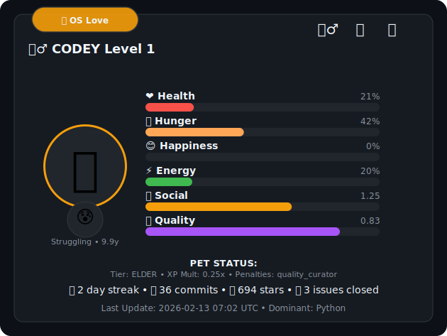

# Codey Default Theme: Technical Breakdown

This document outlines the structure and logic of the `_cl_lab_default.py` theme.

---

## Technical Structure

### 1. Visual Layout (SVG Canvas)

* **Dimensions:** 630x473 pixels.
* **Header:** Contains the tier status, level, prestige indicators, and the last 4 achievements.
* **Pet Zone (Left):** A dedicated area for the language-based pet emoji and the current mood status.
* **Statistics Zone (Right):** A vertical stack of six progress bars.
* **Footer:** Summary of developer integrity, streaks, commit counts, and timestamps.

### 2. Variables and Mapping

* **Tier System:** Colors and emojis mapped to developer rank (Noob, Developer, Veteran, Elder).
* **Pet Mapping:** Dictionary linking dominant repository languages to specific emojis (e.g., Rust to Crab, Python to Snake).
* **Mood System:** Logic reflecting internal status (e.g., Happy, Struggling, Elite).
* **Color Palette:** Fixed hex codes for background, cards, text, and specific status bars (Health, Hunger, Energy).

---

## Functional Components

### Logic Indicators

* **Bar Function:** Normalizes percentage values (0-100) to a maximum SVG width of 330 pixels.
* **Prestige Logic:** Displays star icons if prestige is active or a "Ready" notification if requirements are met.
* **Achievement Display:** Dynamically calculates positioning for the last 4 earned badges to prevent overlap.
* **Issue Line:** Optional display string that only appears if the user has closed issues.

### Status Definitions

* **Health:** Calculated as the mean of Hunger, Happiness, and Energy.
* **Social Score:** Visualizes the network integrity score on a bar scale.
* **Quality Score:** Represents the average repository quality (license presence, documentation, etc.).

---

## Usage and Standards

* **Template Status:** This is the primary core template for Codey. Output changes are tested here first.
* **Contribution Rule:** Understanding the logic within this file is mandatory for Pull Requests.
* **Legal:** Governed by Apache 2.0 and ESOL v1.1 licenses.
