[](https://volkansah.github.io/Codey/)
> Read PHILOSOPHY.md please!

**Codey isn't your typical stats badge.** This is a full-blown RPG system that analyzes your entire coding personality, judges your contributions with zero mercy,
and evolves into different creatures based on what you actually code.

No fake motivation. No participation trophies. Just raw, unfiltered feedback on your dev life.

Daily updates via Actions (still yet github, sorry). Tracks commits, stars, languages, streaks, and more — then brutally scores you on traits like social integrity, code quality, 
and consistency. Your pet evolves (or devolves) based on your real GitHub behavior.

> **⚠️ Current Status:** Testing phase 08.02–18.02.2026 — needs testers brave enough to face the truth! i dont want feet codey wit fake data! 

---


---


<details>
<summary> -  Why Codey is Differentt - </summary> 

### Listen:

**Standard GitHub stats:** "Wow, you made 500 commits!"  
**Codey:** "500 commits, 2 stars, 0 followers. Are you coding in a cave?"

This isn't about counting contributions. It's about **revealing your true coding personality** through a harsh but fair RPG system that tracks:

- **Social Score** — Follower/following ratio, fork behavior, star quality. Spam followers get detected and penalized.
- **Commit Quality** — Message analysis. `fix fix fix oops wip` won't save you here.
- **Issue Integrity** — Open/close ratio + keyword scoring. Closing issues earns XP. Ignoring them kills your score.
- **Dominant Language** — Your pet evolves based on what you actually code.
- **Tier System** — noob → developer → veteran → elder. The older your account, the higher the bar.
- **Prestige System** — Hit max level? Reset for exclusive rewards and prove you're a coding veteran.

### What Codey Actually Tracks

- Daily commits via Events API with direct `/commits` fallback
- Streak (consecutive days coding) — only one place handles this, no double penalties
- Stars earned across ALL your own repos (forks don't count)
- Code quality from commit message analysis
- Issue activity: open/close ratio + keyword patterns
- Social engineering detection: FFR ratio, fork leeching, repo spamming
- Weekend warrior bonus (Saturday/Sunday commits)
- Seasonal events (Hacktoberfest, Advent of Code, and more)

**Important:** Codey only counts stars on YOUR repos. Forking popular projects won't save you here.

</details>
         
---

## The No Mercy System

Codey uses an **unforgiving but honest algorithm** where:

- **Low activity** = Your pet gets sad, tired, or temporarily dies
- **Inconsistent commits** = Streak breaks, XP penalties
- **Lazy commit messages** = Quality score drops
- **Spam following** = Social score tanks hard
- **Fork leeching** = Heavy penalty
- **Weekend coding** = Energy boost
- **Closing issues** = XP reward — taking responsibility matters

```
Mood States:
😊 happy → 😤 grinding → 😰 struggling → 😵 exhausted → 🤯 overwhelmed
         ↘️ 😎 elite (high social score)
         ↘️ 🧐 wise (elder tier + healthy)
```

The exact formulas and brutal penalties are documented in [Behind the Scenes](Behind-the-Scenes.md) — if you dare to look.

---

## Pet Evolution System

Your Codey evolves based on your **dominant programming language**:

| Language | Pet Form | Why |
|----------|----------|-----|
| Python | 🐍 Snake | Classic, powerful |
| JavaScript | 🦔 Hedgehog | Quick, adaptable |
| Rust | 🦀 Crab | Memory-safe beast |
| Go | 🐹 Gopher | Fast, concurrent |
| TypeScript | 🦋 Butterfly | Type-safe elegance |
| Ruby | 💎 Gem Guardian | Elegant, refined |
| PHP | 🐘 Elephant | Never forgets |
| C/C++ | 🦫 Beaver | Low-level builder |
| Java | 🦧 Primate | Enterprise soul |
| Shell/Bash | 🦬 Bison | Raw power |
| *...and more* | 🐲 Dragon | Unlock legendary forms |

**Prestige Mode:** After maxing out, reset your stats to unlock mythical forms and special badges that prove you're a coding veteran.

---

## Tier System — The Older You Are, The Harder It Gets

| Tier | GitHub Age | XP Multiplier | Requirements |
|------|-----------|---------------|--------------|
| 🌱 Noob | < 2 years | 1.0x | Base |
| 💻 Developer | 2–5 years | 0.67x | 1.5x harder |
| ⚔️ Veteran | 5–8 years | 0.40x | 2.5x harder |
| 🧙 Elder | 8+ years | 0.20x | 4x harder |

You've been around long enough. One commit shouldn't level you up.

---

<details>
<summary> - Setup - Make Codey Your Pet - </summary> 


### Quick Start

1. **Fork or copy** this repo
2. **Configure** your token and tracking mode
3. **Add the badge** to your README

### Step 1: Get the Files

```
your-repo/
├── .github/
│   └── workflows/
│       └── update_codey.yml
├── update_codey.py
└── requirements.txt
```

### Step 2: Configure GitHub Token

Create a Personal Access Token for full tracking:

1. GitHub Settings → Developer settings → Personal access tokens → Tokens (classic)
2. Generate new token with these scopes:
   - `repo` — Full control of repositories
   - `read:org` — Required for organization repos
   - `read:user` — User profile data
3. Add as repository secret: Settings → Secrets → Actions → `GIT_TOKEN`

Without `read:org`: only personal public repos are tracked.  
With `read:org`: personal repos + all organizations you're a member of.

### Step 3: Choose Tracking Mode

**Option A — Single Repo:**
```yaml
env:
  GIT_REPOSITORY: 'YourUsername/YourProject'
  GIT_TOKEN: ${{ secrets.GIT_TOKEN }}
```

**Option B — Entire Account (Recommended):**
```yaml
env:
  GIT_REPOSITORY: 'YourUsername'
  GIT_TOKEN: ${{ secrets.GIT_TOKEN }}
```

### Step 4: Embed in Your README

```markdown
[](https://github.com/YourUsername/YourRepo)
```


### or if you realy love the visio of our codey

```markdown
[](https://github.com/Codey-LAB)
```

### Bro if you are realy realy rich,  i am not!

```markdown
Buy me a coffee or pink donuts and world domination is mine, Pinky! 🍩
```

Check out PinkyDB: a crazy way to teach Pinky Boolean logic. Warning: Requires Codey Sidekick Level 30 to understand full pinkys Boolean Engineering. maybe real funny for childs and young teens and { if else } older for learning to, you are ll welcome to meet PinkyDB engine :D .


</details> 


---

## Achievements

> real ? is a hobby if i have time i mean there learn more about me @volkansah
- 💀 **Decade Survivor** — 10+ years on GitHub
- 🧙 **Elder Council** — 8+ years on GitHub
- 👑 **Social Elite** — Social score > 1.2
- 💎 **Quality Craftsman** — Repo quality > 0.8
- 🔥 **Century Streak** — 100 day streak
- 🐛 **Bug Slayer** — 5+ issues closed with 80%+ close ratio
- ⭐ **Prestige Master** — Completed prestige

---

## Seasonal Events

| Month | Event | Bonus |
|-------|-------|-------|
| October | 🎃 Hacktoberfest | 1.5x |
| December | 🎄 Advent | 1.3x |
| July | 🔥 Grind Season | 1.4x |
| May | 🚀 Deploy Month | 1.3x |
| January | 🎯 New Year | 1.2x |
| ...and more | every month has a bonus | — |

---

## Roadmap

- [ ] GitLab support
- [ ] Backround accelator integration (Codey gets a real brain) idea on hf only for hock .js i mean. repo klosed for core on codey-lab
- [ ] brain_bug.log as official feature (when Brain is ready) (start tests)
- [x] API endpoint for live stats, yes and no! 
- [ ] PostgreSQL integration for historical tracking for Issue quality analysis testening backround
- [ ] Issue quality analysis, must fixsome stuff. i found new pattern
- [x] Fallback commit detection for private/org repos
- [x] Double streak penalty bug fixed
- [x] Weekend bonus inflation bug fixed
- [ ] Heartbeat skin, logik test (most not publik sorry.)
> - [x] yeah i see i hate python! i love PHP! Pros know why check up soon my new PDF-CVE format. no its not an PDF! The funtions was clean! see history

---

## Known Issues

- ✅ ~~Streak was penalized twice~~ — Fixed: single source of truth
- ✅ ~~Weekend bonus inflated total_commits~~ — Fixed: raw commits tracked separately
- ✅ ~~Commits always 0 in org repos~~ — Fixed: direct /commits fallback
- ✅ ~~Everyone was a dragon~~ — Evolution system fixed
- ✅ ~~Codey on drugs~~ — Energy calculation normalized
- ✅ ~~Seasonal text overflow in SVG~~ — Fixed: wider box
- ✅ some stuf if i have time.. ist test time

---

## Contributing

Found a bug? oh no Codey kan die!  Want to add features? PRs welcome!

- Test the No Mercy Edition and report issues, please or 💔
- Add new pet forms for different languages
- Improve the brutal scoring algorithm
- Design new achievements (soon  promise)
- Write better insults for low performers (kidding... or am I? hmm... finger cross behind back :S)

---

## License

This project is dual-licensed under **Apache 2.0** and the **Ethical Security Operations License (ESOL v1.1)**.

The ESOL is a mandatory, non-severable condition of use. By using this software, you agree to all ethical constraints defined in ESOL v1.1.

> Free to use and modify. Selling this script or using it for reputation manipulation is explicitly prohibited.  
> Jurisdiction: Germany (Berlin) — enforced under StGB §202a/b/c and DSGVO.  
> [ESOL v1.1](https://github.com/ESOL-License/ESOL/)
> Read code header why for codey too!!! its not a game its an open source audit!

---
<details>
<summary> - Changelog - </summary> 
13.02.2026 , sorry real only docu and some ideas i made publik,i will tell later why this all. best read :D im the 🐻 who explains  , se blobb
### [2.1.0]
#### Added
- Issue quality analysis via IssuesEvent (open/close ratio + keyword scoring)
- XP reward for closing issues
- Bug Slayer achievement
- Direct `/commits` API fallback when Events API returns 0 (org/private repos)
- brain_bug.log documents the real dev workflow of this session

#### Fixed
- **Streak double penalty** — `calculate_skill_decay()` was also decrementing streak,
  causing double punishment combined with `update_brutal_stats()`.
  Note: core logic was always correct — architectural conflict between two functions.
- **Weekend bonus inflating total_commits** — bonus now only affects XP/rewards,
  raw commit count tracked separately for accurate leveling.
- Seasonal bonus text overflow in SVG
- Commit counting for organization repositories

#### Changed
- Events API with direct `/commits` fallback for reliability
- `GIT_TOKEN` with `read:org` recommended for full tracking

### [2.0.0] 
#### Changed
- Complete rewrite: No Mercy Edition
- Tier system, social engineering detection, commit quality analysis
- Prestige system, achievements, skill decay


### [idea] baby codey

</details>


---

## About

Built by **[Volkan Sah](https://github.com/volkansah)** — a developer who believes in honest feedback, even when it hurts.

v2.1 dumpy bugs fixed with assistance of **Claude (Anthropic)** — AI-assisted, human-verified. The core logic was always right. brain_bug.log (soon in codey) proves no AI wrote this alone.

---

## Disclaimer

Codey is brutally honest. If you have thin skin about your coding habits, maybe stick to regular GitHub stats.

This pet will call out your inconsistency, judge your commit frequency, question your star count, and mock your broken streaks.

But it will also celebrate real achievements, reward consistent effort, and make you a better developer. Probably.

**Codey is just code. But if it makes you code more, mission accomplished.**

---


**Made with much coffee and brutal honesty**

- [Star this repo](https://github.com/VolkanSah/Codey) if Codey made you cry (in a good way)
- [Star this repo](https://github.com/Codey-LAB/.github) to spreed love and freedom for open source! Don`t be evil morty! Dont be , i get you! 
- [volkansah.github.io/Codey](https://volkansah.github.io/Codey/) , my codey... oh i am terrible sorry codey! ⚠️
 use version on https://github.com/Codey-LAB/
  > will be updatet by ai sitecick later. thanks for reading still here and hoplly you codey is fun 🤟

##### Export notes 
> **Licensing Statement:** > This Work is dual-licensed under the **[APACHE](LICENSE)** and the **Ethical Security Operations License [ESOL v1.1](ESOL)**. The ESOL is a mandatory, non-severable condition of use. By using this software, you agree to all ethical constraints defined in the ESOL v1.1.
> Export ~1600


