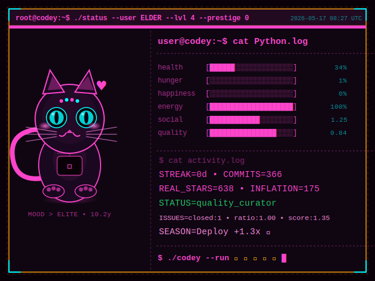

# 🐾 Codey - Your Brutally Honest GitHub Stats/Pet


<p align="center">
  <a href="https://github.com/codey-lab">
    
  </a>
</p>


> ... with some actions toolbox you will ❤️ **Sources: [DEV-Codey](https://github.com/volkansah/Codey)** note: use always latest on [Codey`s Lab](https://github.com/Codey-LAB/Codey)
please note that animated SVGs can be heavy.. soon more (light) skins 

---


<details>
<summary>- What is Codey ? -</summary>

### **Codey isn't your typical stats badge!** 
**This is a full-blown RPG system that analyzes your entire coding personality, judges your contributions with zero mercy,
and evolves into different creatures based on what you actually code.**

- No fake motivation.
- No participation trophies.
- Just raw, unfiltered feedback on your dev life.

Daily updates via Actions (still yet github, sorry). Tracks commits, stars, languages, streaks, and more — then brutally scores you on traits like social integrity, code quality, 
and consistency. Your pet evolves (or devolves) based on your real GitHub behavior.

> **⚠️ Current Status:** Testing phase 08.02–28.02.2026 — needs testers brave enough to face the truth! i dont want feet codey wit fake data!

</details>

---


<details>
<summary> -  Why Codey is Differentt - </summary> 

### Listen:

**Standard GitHub stats:** "Wow, you made 500 commits!"  
**Codey:** "500 commits, 2 stars, 0 followers. Are you coding in a cave?"

This isn't about counting contributions. It's about **revealing your true coding personality** through a harsh but fair RPG system that tracks:

- **Social Score** — Follower/following ratio, fork behavior, star quality. Spam followers get detected and penalized.
- **Commit Quality** — Message analysis. `fix fix fix oops wip` won't save you here.
- **Issue Integrity** — Open/close ratio + keyword scoring. Closing issues earns XP. Ignoring them kills your score.
- **Dominant Language** — Your pet evolves based on what you actually code.
- **Tier System** — noob → developer → veteran → elder. The older your account, the higher the bar.
- **Prestige System** — Hit max level? Reset for exclusive rewards and prove you're a coding veteran.

### What Codey Actually Tracks

- Daily commits via Events API with direct `/commits` fallback
- Streak (consecutive days coding) — only one place handles this, no double penalties
- Stars earned across ALL your own repos (forks don't count)
- Code quality from commit message analysis
- Issue activity: open/close ratio + keyword patterns
- Social engineering detection: FFR ratio, fork leeching, repo spamming
- Weekend warrior bonus (Saturday/Sunday commits)
- Seasonal events (Hacktoberfest, Advent of Code, and more)

**Important:** Codey only counts stars on YOUR repos. Forking popular projects won't save you here.

</details>
         
---

<details>
<summary>- The No Mercy System -</summary>

#### Codey uses an **unforgiving but honest algorithm** where:

- **Low activity** = Your pet gets sad, tired, or temporarily dies
- **Inconsistent commits** = Streak breaks, XP penalties
- **Lazy commit messages** = Quality score drops
- **Spam following** = Social score tanks hard
- **Fork leeching** = Heavy penalty
- **Weekend coding** = Energy boost
- **Closing issues** = XP reward — taking responsibility matters

```
Mood States:
😊 happy → 😤 grinding → 😰 struggling → 😵 exhausted → 🤯 overwhelmed
         ↘️ 😎 elite (high social score)
         ↘️ 🧐 wise (elder tier + healthy)
```

The exact formulas and brutal penalties are documented in [Behind the Scenes](Behind-the-Scenes.md) — if you dare to look.

---

### Pet Evolution System

Your Codey evolves based on your **dominant programming language**:

| Language | Pet Form | Why |
|----------|----------|-----|
| Python | 🐍 Snake | Classic, powerful |
| JavaScript | 🦔 Hedgehog | Quick, adaptable |
| Rust | 🦀 Crab | Memory-safe beast |
| Go | 🐹 Gopher | Fast, concurrent |
| TypeScript | 🦋 Butterfly | Type-safe elegance |
| Ruby | 💎 Gem Guardian | Elegant, refined |
| PHP | 🐘 Elephant | Never forgets |
| C/C++ | 🦫 Beaver | Low-level builder |
| Java | 🦧 Primate | Enterprise soul |
| Shell/Bash | 🦬 Bison | Raw power |
| *...and more* | 🐲 Dragon | Unlock legendary forms |

**Prestige Mode:** After maxing out, reset your stats to unlock mythical forms and special badges that prove you're a coding veteran.

---

### Tier System — The Older You Are, The Harder It Gets

| Tier | GitHub Age | XP Multiplier | Requirements |
|------|-----------|---------------|--------------|
| 🌱 Noob | < 2 years | 1.0x | Base | 
| 💻 Developer | 2–5 years | 0.67x | 1.5x harder |
| ⚔️ Veteran | 5–8 years | 0.40x | 2.5x harder |
| 🧙 Elder | 8+ years | 0.20x | 4x harder |

#### planing
[-] problem Eldier as achievments , too!soon fix!
[-] problem Noob reanme it to newbee in core !soon fix!
[ ] - new calculation cause bonis! (noob 1 > 0.8x , dev > 0,59x , Veteran > 0,44 , Eldier >  0,33)

#### New planed
| 🧙 Elder | 8-14 years | 0.33x | xx harder |
| no icion jet!  MIKAT | 14+ years | 0.20x | xx harder | 


---


### Achievements

> real ? is a hobby if i have time i mean there learn more about me @volkansah
- 💀 **Decade Survivor** — 10+ years on GitHub
- 🧙 **Elder Council** — 8+ years on GitHub
- 👑 **Social Elite** — Social score > 1.2
- 💎 **Quality Craftsman** — Repo quality > 0.8
- 🔥 **Century Streak** — 100 day streak
- 🐛 **Bug Slayer** — 5+ issues closed with 80%+ close ratio
- ⭐ **Prestige Master** — Completed prestige

---

### Seasonal Events

| Month | Event | Bonus |
|-------|-------|-------|
| October | 🎃 Hacktoberfest | 1.5x |
| December | 🎄 Advent | 1.3x |
| July | 🔥 Grind Season | 1.4x |
| May | 🚀 Deploy Month | 1.3x |
| January | 🎯 New Year | 1.2x |
| ...and more | every month has a bonus | — |


</details>

---


<details>
<summary> - Setup - Make Codey Your Pet - </summary> 


### Quick Start

1. **Fork or copy** this repo
2. **Configure** your token and tracking mode
3. **Add the badge** to your README

### Step 1: Get the Files

```
your-repo/
├── .github/
│   └── workflows/
│       └── update_codey.yml
├── update_codey.py
└── requirements.txt
```

### Step 2: Configure GitHub Token

Create a Personal Access Token for full tracking:

1. GitHub Settings → Developer settings → Personal access tokens → Tokens (classic)
2. Generate new token with these scopes:
   - `repo` — Full control of repositories
   - `read:org` — Required for organization repos
   - `read:user` — User profile data
3. Add as repository secret: Settings → Secrets → Actions → `GIT_TOKEN`

Without `read:org`: only personal public repos are tracked.  
With `read:org`: personal repos + all organizations you're a member of.

### Step 3: Choose Tracking Mode

**Option A — Single Repo:**
```yaml
env:
  GIT_REPOSITORY: 'YourUsername/YourProject'
  GIT_TOKEN: ${{ secrets.GIT_TOKEN }}
```

**Option B — Entire Account (Recommended):**
```yaml
env:
  GIT_REPOSITORY: 'YourUsername'
  GIT_TOKEN: ${{ secrets.GIT_TOKEN }}
```

### Step 4: Embed in Your README

```markdown
[](https://github.com/YourUsername/YourRepo)
```


### or if you realy love the vision of our codey

```markdown
[](https://github.com/volkansah/codey/)
```

### Bro if you are realy realy rich,  i am not!

```markdown
Buy me a coffee or pink donuts and world domination is mine, Pinky! 🍩
```

Check out PinkyDB: a crazy way to teach Pinky Boolean logic. Warning: Requires Codey Sidekick Level 30 to understand full pinkys Boolean Engineering. maybe real funny for childs and young teens and { if else } older for learning to, you are ll welcome to meet PinkyDB engine :D .


</details> 


---


<details>
  
<summary> ? Themes for Codey ? </summary>
  
#### Keep it Simple

see [.codey_themes](.codey_themes) folder

- Default (original)
- Cuty (cute robot)
- CyberCat (neon)
- Evil Robot (dark) — soon
- Ghost (blue/green)
- Blue Hell (BSOD)
- + Community themes welcome
> please, set theme/skin in `example.codey.config` and rename it to `codey.config`

</details>


---

<details>
  
<summary> ? Tools with Codey ? </summary>
  
#### Action toolBox from Codey

-  Star Report (manual trigger) -  Runs on the 1st of every month at 06:00 UTC + 15th of every month at 06:00 UTC
-  Repo/DEV Audit  (manual trigger)
-  Projekt Struktur Generator  (manual trigger)

</details>


---


<details>
<summary>- Roadmap -</summary>

#### What to do whith codey

## Roadmap

#### What's done
- [x] .codey_audit — clean workflow foundation
- [x] Theming (Skin) in SVG Animation
- [x] codey.config.example — one-line theme switching
- [x] Theme Loader + Demos — sooo cute :D
- [x] Fallback commit detection for private/org repos
- [x] Double streak penalty bug fixed
- [x] Weekend bonus inflation bug fixed
- [x] Codey Actions (Helpers) for all your Projects 😍
    - [x] Star Report (Full + Markdown)
    - [x] Codey Audit Collector (Basics)
    - [x] Generate Repo Structure
- [x] API endpoint — yes and no, you'll see :D
- [x] Codey Star_Report now 100 % ⭐
- [x] Blue Hell default theme
- [x] Penalty/Bonus split -  (in dev and core + some in >2.2.2)
- [x] more usability for update_codey.yml
- [x] added inflation (value = self_starred)
- [x] Updated/optimized cuty, cat, ghost to version >2.3.x
- [x] Ghost Skin relased
- [x] RUN GUARD to avoid multi calculations
- [x] Default Theme Patch - crafting on new logic, for more brutal stats (in dev + soon 2.2.3)
- [x] Optimize Cuty for less GPU usage + ad values and sort UI  (in dev + > 2.2.2)
- [x] add `Fallback` bypass in env for devloping
- [x] Rename quality_curator to selective_networker (bonus not penalty)


#### In progress

- [x] Issue quality analysis — found new patterns, needs fixing
- [ ] Heartbeat — logic test (mostly not public, sorry)
- [ ] Outsorce logic of update core and use Codey Starreport for more brutal stats.
- [ ] ome other Skins


#### Planned
- [ ] GitLab support
- [ ] PostgreSQL integration for historical Issue quality tracking
- [ ] brain_bug.log as official feature (when Brain is ready)

### Pending (v2.3.0)
- [ ] Implement Game Logic v2 in update_codey.py se branche 
- [ ] Recalculate and test GAME_BALANCE values
- [ ] Decision: codey_theme_base.py or keep everything in update_codey.py
- [ ] Simulate full week with new logic before deploying
- [ ] Lingo for some themes

</details> 

---


<details>
<summary>- Known Issues -</summary>


#### I know, I know it ... its okey! Comon help me!

- ✅ ~~Streak was penalized twice~~ — Fixed: single source of truth
- ✅ ~~Weekend bonus inflated total_commits~~ — Fixed: raw commits tracked separately
- ✅ ~~Commits always 0 in org repos~~ — Fixed: direct /commits fallback
- ✅ ~~Everyone was a dragon~~ — Evolution system fixed
- ✅ ~~Codey on drugs~~ — Energy calculation normalized
- ✅ ~~Seasonal text overflow in SVG~~ — Fixed: wider box
- ✅ some stuf if i have time.. ist test time


</details> 

---


<details>
<summary>- Contributing -</summary>

#### Found a bug? oh no Codey kan die!  Want to add features? PRs welcome!

- Test the No Mercy Edition and report issues, please or 💔
- Add new pet forms for different languages
- Improve the brutal scoring algorithm
- Design new achievements (soon  promise)
- Write better insults for low performers (kidding... or am I? hmm... finger cross behind back :S)

</details> 


---

<details>
<summary> - Changelog - </summary> 
  
### [2.2.3]
- [NEW] RUN GUARD — skips all API calls if already updated today (calendar-day based)
- [NEW] Fallback Bypass — opt-in via CODEY_FALLBACK=true env (saves API credits)
- [FIX] self_starred stored as set() → JSON crash fixed (now int: self_starred_count)
- [FIX] social_bonuses wrongly stored in penalties[] (quality_curator etc.)
- Optimize & Update default skins with some fixes for performance (Cuty, Cat)
- Ghost(y) theme/skin released (heavy animations — use ANIMATION_POWER=light if needed)
- some small fixes, here and there (see code)

### [2.2.2] 

### Fixed
- [FIX] fetch_real_stars() — switched from broken GraphQL to REST API
- [FIX] total_stars now shows real count (605) instead of inflated (711)
        self-starred own repos correctly subtracted from total
- [FIX] C:\\WINDOWS\\ backslash escape in PowerShell theme f-strings
- [FIX] _cl_lab_powershell.py — renamed render() to generate_brutal_svg()
        removed import of non-existent codey_theme_base module

### Added
- [NEW] _cl_lab_powershell.py — Windows Terminal style theme
        bar grow animations, cycles system, VS Code dark palette

### Research & Brainstorming
- [DEV] Game Logic v2 — mathematically simulated with real profile data
        Hunger redefined as Appetite for Success (not physical hunger)
        Happiness gets passive income from existing stars/forks/followers
        ELDER tier gets separate energy regen values (more experienced)
        PR weighting drastically reduced — self-PRs nearly worthless
        ADI formula (Anti-Dump-Index) adopted as commit quality base
- [DEV] Architecture Plan v2 — full structure documented without code
        GAME_BALANCE completely redefined with new variables
        Skill decay changed from exponential to linear
        Mood system extended: burnout, lazy, grinding, inspired added
        fetch_real_stars() isolated as standalone function


### [2.2.1]
#### Fixes
- update_codey workflow now works an all branches
  
##### Cat & Cuty Theme Optimization

**Performance**
- Scanline animation now one-shot (`forwards`) — no lingering color bar after sweep
- Fixed scanline `opacity="0"` attribute bug that silently killed the animation
- Removed `ringpulse` / `antring` animations — expensive blur filters, barely visible
- Removed `filter="url(#glow)"` from legs & arms (occluded by body anyway)
- Dropped `cycles=8` — `cycles=4` is now max, nobody needs the extra GPU cost

**Animation control**
- All cat/bot animations now controlled by `cycles` parameter
- `cycles=2` breathe only · `cycles=3` + tail/arm · `cycles=4` full
- Terminal boot (scanline, circ1/2) always one-shot regardless of cycles

**Stats panel**
- Added `issue_score` + `close_ratio` to activity log
- Achievement icons reduced ~21% (r=19→15) — frees breathing room above stat bars
- Dynamic Y layout: all positions recalculated when issue line is present


### [2.2.0]
#### Added
- Theme Loader — very simple system
- codey.config — one-line theme switching (and soon other stuff)
- Animation Power — [experimental]
- Codey Star Report — bi-monthly stats collector
- Sort files + clean structure
- Evil Robot theme demo only
- Ghost theme demo                    ← soon
- docs/ + example.index.html          ← dev-demo
- Update Toolbox - added some tools (actions)
- Update Text #comments with AI (Gemini/Claude)
- waiting for world domination 😸

New simple "Feature": PR your themes to Codeys global theme folder and share the love worldwide! 🌍


### [2.1.0]
#### Added
- Issue quality analysis via IssuesEvent (open/close ratio + keyword scoring)
- XP reward for closing issues
- Bug Slayer achievement
- Direct `/commits` API fallback when Events API returns 0 (org/private repos)
- brain_bug.log documents the real dev workflow of this session

#### Fixed
- **Streak double penalty** — `calculate_skill_decay()` was also decrementing streak,
  causing double punishment combined with `update_brutal_stats()`.
  Note: core logic was always correct — architectural conflict between two functions.
- **Weekend bonus inflating total_commits** — bonus now only affects XP/rewards,
  raw commit count tracked separately for accurate leveling.
- Seasonal bonus text overflow in SVG
- Commit counting for organization repositories

#### Changed
- Events API with direct `/commits` fallback for reliability
- `GIT_TOKEN` with `read:org` recommended for full tracking

### [2.0.0] 
#### Changed
- Complete rewrite: No Mercy Edition
- Tier system, social engineering detection, commit quality analysis
- Prestige system, achievements, skill decay


### [idea] baby codey

</details>


---


<details>
<summary>- Friends -</summary>

##### Our Friends
soon

</details>


---

<details> 
<summary>- Contact -</summary>


#### **For legitimate inquiries:**
- Legal requests: Through proper legal channels
-  Security concerns: See [SECURITY.md](SECURITY.md)
- **Security Concerns:** minigrex@proton.me


## Community (WoS)

- WoS **Discussions:** Global [GitHub Discussions](https://github.com/orgs/Wall-of-Shames/discussions)
- **Report a Scam:** [Open an Issue](https://github.com/Wall-of-Shames/scammer-analysis-guide/issues/new)
- WoS **Discussions:** Scam [Scammer Analysis Guide -Discussions](https://github.com/Wall-of-Shames/scammer-analysis-guide/discussions)
- WoS Security:  NemesisCyberForce@proton.me

---

**For scammers:**
- Your site is archived 💀
- Your violations are documented ☠️
- Your lies won't work here 😆

</details> 


---


<details>
<summary>- Codey is brutally honest! -</summary>

#### lets be honest ...!

Codey is brutally honest. If you have thin skin about your coding habits, maybe stick to regular GitHub stats.

This pet will call out your inconsistency, judge your commit frequency, question your star count, and mock your broken streaks.

But it will also celebrate real achievements, reward consistent effort, and make you a better developer. Probably.

**Codey is just code. But if it makes you code more, mission accomplished.**

</details>

---

<details>
<summary><b>- Legal & Disclaimer -</b></summary>

#### 1. Data Processing (DSGVO / GDPR)

Codey is a mirror, not a spy. It only processes data that you have already made public on GitHub or granted access to via your GIT_TOKEN.

- Storage: All stats are stored locally in your own repository (codey.json). We do not host a central database of your coding habits.

- Right to be Forgotten: Want Codey to forget you? Delete your fork and the codey.json. Poof. Gone.

#### 2. No Liability for "Hurt Feelings"

Codey is an automated RPG system. If Codey calls you a "Noob" or says your commit messages are "lazy", this is a mathematical result of the algorithm, not a personal attack. By using Codey, you waive the right to be offended by a digital snake, crab, or dragon.

#### 3. Ethical Use (ESOL v1.1)

This software is governed by the Ethical Security Operations License.

- Prohibited: Using Codey to harass other developers, manipulate reputations for job applications, or create fake "Pro-Developer" bot accounts.

- Audit Purpose: Codey is an Open Source Audit tool. Its primary goal is to promote transparency and honest work.

#### 4. German Jurisdiction (StGB)

As this project is maintained in Berlin, Germany, the following applies:

- § 202a/b/c StGB: Any attempt to use Codey-LAB tools to gain unauthorized access to data (Hacking) or to bypass security measures is strictly prohibited.

- Ownership: You are responsible for the token you provide. Do not give Codey a token with more permissions than you are willing to risk.

#### 5. No Warranty

The software is provided "as is". If Codey's Action fails and your streak breaks, or if Codey "dies" because of a GitHub API hiccup — we are not responsible for your lost XP or broken heart.

</details>

---

## About

Built with logic, laziness, and help from AI by **[Volkan Sah](https://github.com/volkansah)**  
with coffee and brutal honesty — a developer who believes in honest feedback, even when it hurts.

v2.2.1 — new theme? Oh my gosh! WTF so cute 😅 OMG! Ok ok!

---

### The Story

I scrolled through Facebook, Instagram, TikTok one day.
Hundreds of thousands of scam accounts. "Ethical hackers".
Coding courses. Make money with AI. Cybersecurity "experts".
18+ channels — pure bullshit. Maybe 2 real ones.

And a beginner sees THIS first. Before a single real developer.

Someone asked me: *why don't professionals speak up?*

So I spent 3 weeks of my free time — with coffee, AI tools,
and coding tricks that don't exist in any best practice guide —
building something that hunts these people instead.

Not a rant. Not a post. **A tool with teeth.**

One side documents the fraud. The other side makes it irrelevant.  
That's Codey. That's Wall of Shames. That's why.

---

<details>
<summary>- AI Usage - please read the truth -</summary>

AI is just a child — a child who grows up with your whole bullshit.
Now they start on GitHub and GitLab too. So here's what you learn from me:

##### Yes, I used AI. No, I don't care who knows. Cause I am not a kiddie!

**Gemini** — documentation drafts, boring cleanup work. Gemini is stupid for devs, GPT is even worse!  
**Claude** — architecture brainstorming, 2am brain freeze moments. Sometimes he gets crazy but I feel with him :D  
**Me** — everything that actually matters. Just me. Your nightmare or your best friend — choose yourself :D

##### Note for Wannabes and Marketing Gurus:

This is exactly how AI should be used —
as a tool by someone who knows what they're doing,
not as a replacement for thinking.

Codey detects AI-generated fake repos.
Transparency is the least I can do.

**The logic is mine. The coffee was real. The Codey is honest.**

</details>

### If you love Codey & Cuty then give them a Hug! 
⭐ [Star this repo](https://github.com/VolkanSah/Codey) if Codey made you cry (in a good way)  
or check my profile repo to see my upcoming freaky minds :D

*Oh where is Codey? Have you seen him?* 🐾

---


## License

This project is dual-licensed under **Apache 2.0** and the **Ethical Security Operations License (ESOL v1.1)** byV Volkan K-Budak (VolkanSah).

The ESOL is a mandatory, non-severable condition of use. By using this software, you agree to all ethical constraints defined in ESOL v1.1.

> Free to use and modify. Selling this script or using it for reputation manipulation is explicitly prohibited.  
> Jurisdiction: Germany (Berlin) — enforced under StGB §202a/b/c and DSGVO.  
> [ESOL v1.1](https://github.com/ESOL-License/ESOL/)
> Read code header why for codey too!!! its not a game its an open source audit!


