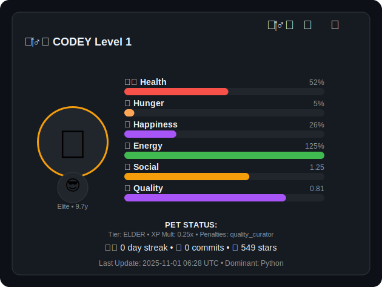

# 🐾 Codey - Your Brutally Honest GitHub Pet
### RPG "No Mercy" Edition - Where Your Code Gets Judged For Real

*"You killed Kenny! You bastards!"* — Well, Codey won't die, but your coding reputation might.

[](https://volkansah.github.io/Codey/)

**Codey isn't your typical GitHub stats badge.** This is a full-blown RPG system that analyzes your entire coding personality, judges your contributions with zero mercy, and evolves into different creatures based on what you actually code. 

No fake motivation. No participation trophies. Just raw, unfiltered feedback on your dev life.

Daily updates via GitHub Actions. Tracks commits, stars, languages, streaks, and more — then brutally scores you on traits like creativity, curiosity, and teamwork. Your pet evolves (or devolves) based on your real GitHub behavior.

> **⚠️ Current Status:** Dev build, needs testers brave enough to face the truth!


## Why Codey is Different

**Standard GitHub stats:** "Wow, you made 500 commits! 🎉"  
**Codey:** "500 commits, 2 stars, 0 followers. Are you coding in a cave?"

This isn't about counting contributions. It's about **revealing your true coding personality** through a harsh but rewarding RPG system that tracks:

- **Social Status** — Based on total stars earned (not given)
- **Personality Type** — Calculated from follower/following ratio (Influencer? Explorer? Balanced?)
- **Dominant Language** — Your pet evolves based on what you actually code (🐍 Python dragon, 🦊 JavaScript fox, 🦀 Rust crab, etc.)
- **Professional Traits** — Creativity, curiosity, teamwork — tracked and displayed
- **Achievements** — Unlock badges for real milestones: `🔥 Monthly Warrior`, `💯 Commit Master`, `⭐ Social Star`
- **Prestige System** — Hit max level? Reset everything for exclusive rewards and flex harder

### What Codey Actually Tracks

- Daily & all-time commit counts
- Stars earned (across ALL your repos)
- Code streak (consecutive days coding)
- Most-used programming language
- Social metrics (followers, following, forks)
- Weekend warrior status (yes, Saturday commits count double)
- Seasonal event participation (Hacktoberfest, Advent of Code)

**Important:** Codey only counts stars on YOUR repos. Forking popular projects won't save you here.


## The No Mercy System

Codey uses an **unforgiving leveling algorithm** where:

- **Low activity** = Your pet gets sad, tired, or dies (temporarily)
- **Inconsistent commits** = Streak breaks, XP penalties
- **No stars on repos** = Social status tanks
- **Weekend coding** = Energy boost, level gains
- **Seasonal events** = Special bonuses and visual upgrades

Your pet has **health, energy, mood, and advanced RPG stats** that change based on real behavior:

```
Mood States:
😊 happy → ☕ tired → 😰 stressed → 😡 angry → 💀 dead
           ↘️ 🤔 bored → 😴 sleepy → 😵 overwhelmed
                          ↘️ ✨ inspired
```

The exact formulas and brutal penalties are documented in [Behind the Scenes](Behind-the-Scenes.md) — if you dare to look.


## Pet Evolution System

Your Codey evolves based on your **dominant programming language**:

| Language | Pet Form | Why |
|----------|----------|-----|
| Python | 🐍 Dragon | Classic, powerful |
| JavaScript | 🦊 Fox | Quick, adaptable |
| Rust | 🦀 Crab | Memory-safe beast |
| Go | 🐹 Gopher | Fast, concurrent |
| TypeScript | 🦅 Eagle | Type-safe ruler |
| Ruby | 💎 Gem Guardian | Elegant, refined |
| PHP | 🐘 Elephant | Never forgets |
| C/C++ | ⚔️ Knight | Low-level warrior |
| Java | ☕ Coffee Spirit | Enterprise soul |
| *...and more* | 🐲 Mythical forms | Unlock legendary creatures |

**Prestige Mode:** After maxing out, reset your stats to unlock **mythical forms** and special visual badges that prove you're a coding veteran.


## Setup - Make Codey Your Pet

### Quick Start (3 Steps)

1. **Fork or copy** this repo
2. **Configure** tracking mode in `.github/workflows/update_codey.yml`
3. **Add the badge** to your README

### Step 1: Get the Files

Copy these into your repo:
```
your-repo/
├── .github/
│   └── workflows/
│       └── update_codey.yml
├── update_codey.py
└── requirements.txt
```

### Step 2: Choose Your Tracking Mode

Edit the workflow's `env` section:

**Option A - Track Single Repo:**
```yaml
env:
  GIT_REPOSITORY: 'YourUsername/YourProject'
```

**Option B - Track Entire Account (Recommended for profile README):**
```yaml
env:
  GIT_REPOSITORY: 'YourUsername'
```

> 💡 **Pro Tip:** For full stats including private repos, use a `GITHUB_TOKEN` with `repo` permissions.

### Step 3: Embed in Your README

After the first workflow run, add this to your `README.md`:

```markdown

```

**Done!** Codey updates daily at midnight UTC and judges you accordingly.


## What Gets Tracked

### Daily Stats
- Commits today
- Current streak
- Energy level
- Mood state

### All-Time Stats
- Total commits
- Total stars earned
- Level & XP
- Achievements unlocked
- Prestige rank (if applicable)

### Professional Traits
- **Creativity** — Based on project diversity
- **Curiosity** — Following/exploring new repos
- **Teamwork** — Collaboration metrics

### Personality Type
Calculated from your social graph:
- **Influencer** — High followers, low following
- **Explorer** — Low followers, high following  
- **Balanced** — Even ratio


## Achievements & Seasonal Events

Unlock special badges for major milestones:

- 🔥 **Monthly Warrior** — 20+ commits this month
- 💯 **Commit Master** — 100+ total commits
- ⭐ **Social Star** — 50+ stars earned
- 🌙 **Night Owl** — Commits after midnight
- 🏆 **Weekend Warrior** — Saturday/Sunday coding

**Seasonal Boosts:**
- 🎃 **Hacktoberfest** (October) — Double XP for PRs
- 🎄 **Advent of Code** (December) — Special daily challenges
- 🎂 **Repo Birthday** — Bonus on your repo's anniversary


##  Roadmap

- [ ] PostgreSQL integration for historical tracking
- [ ] Multi-language pet forms (more creatures!)
- [ ] Team/organization support
- [ ] API endpoint for live stats
- [ ] More brutal judging algorithms (yes, really)
- [ ] Community leaderboards (compare your pain)


## 🐛 Known Issues (Fixed)

- ✅ ~~Everyone was a dragon~~ — Evolution system fixed
- ✅ ~~Codey on drugs~~ — Energy calculation normalized  
- ✅ ~~Some dragons~~ — Species diversity restored


## 🤝 Contributing

Found a bug? Want to add features? PRs welcome!

**Ways to contribute:**
- Test the No Mercy Edition and report issues
- Add new pet forms for different languages
- Improve the brutal scoring algorithm
- Design new achievements
- Write better insults for low performers (kidding... or am I?)


## License

Apache 2.0 License by Volkan Kücükbudak

Use it, fork it, judge yourself with it. Just keep the attribution and don't blame me when Codey roasts you.


## 💬 About the Author

Built by **[Volkan Sah](https://github.com/volkansah)** — A developer who believes in honest feedback, even when it hurts.

**Other projects:**
- [GitHub Profile](https://github.com/volkansah)
- [More brutal tools](https://github.com/volkansah?tab=repositories)


## ⚠️ Disclaimer

Codey is brutally honest. If you have thin skin about your coding habits, maybe stick to regular GitHub stats. 

This pet will:
- Call out your inconsistency
- Judge your commit frequency  
- Question your star count
- Mock your broken streaks

But it will also:
- Celebrate real achievements
- Reward consistent effort
- Evolve with your skills
- Make you a better developer (probably)

**Remember:** Codey is just code. But if it makes you code more, mission accomplished. 🎯


### Live Example

Check out my Codey in action: [volkansah.github.io/Codey](https://volkansah.github.io/Codey/)

**Spoiler:** Even I get roasted sometimes. That's the point.


<div align="center">

**Made with ☕ and brutal honesty**

[⭐ Star this repo](https://github.com/VolkanSah/Codey) if Codey made you cry (in a good way)

</div>
